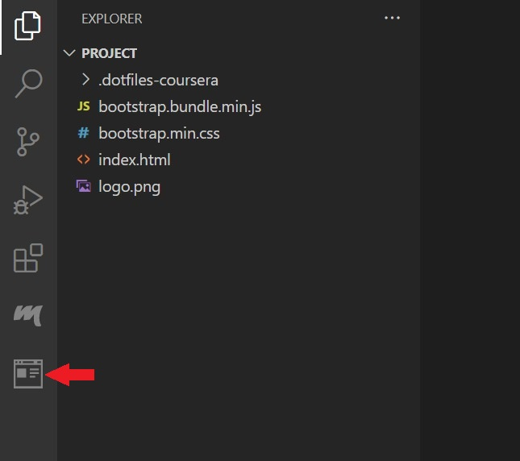

 ## **Tips: Before you Begin**
> - To view this file in Preview mode, right click on this README.md file and `Open Preview`

 
 

### To your view the rendered HTML in a Web Page follow the step by step instructions below:
 

**Step 1**: Save the file.

**Step 2**: Click on 'Go live' at the bottom right of your editor.

Once the server is up and running you'll see the exposed port.

**Step 3**: Click on browser preview.

**Step 4**: Enter the url as http://localhost:<exposed port>  

**Step 5**: Check that the web page displays.

After completing your lab, don't forget to close the server. You can close the server by clicking on the exposed Port number (e.g. 5500) after completing the lab.

You should see a notification like this which confirms the server has been stopped.

